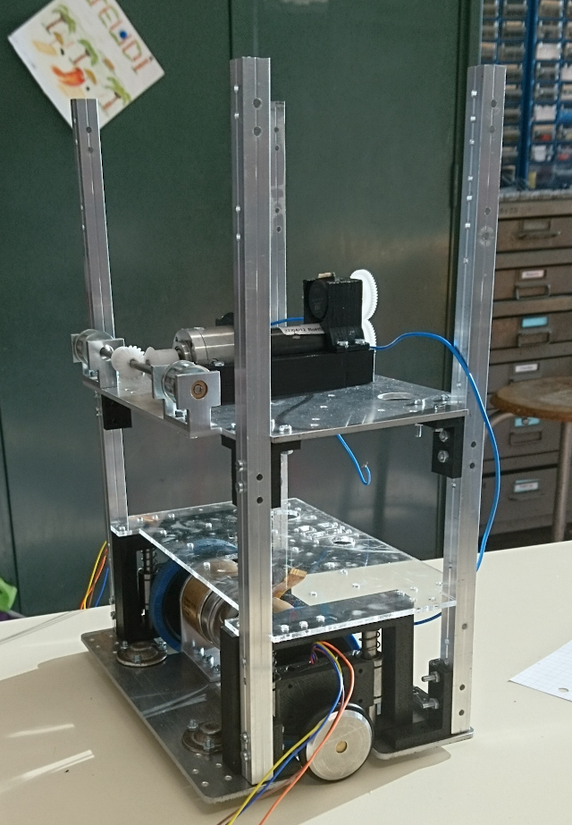

# Asservissement du robot en position
Chaque année les étudiants de première année du club se retrouvent un peu perdus sur les tâches à réaliser et quelles sont les tâches essentielles à réaliser pour pouvoir présenter un robot à la coupe de France de robotique <https://www.coupederobotique.fr/> (pour les règles et autres informations).  
Dans ce tutoriel il va donc être expliqué comment faire une base de robot qui roule de manière fiable.  
Une base roulante fiable commence par une mécanique correctement réalisée, ce qui est expliqué dans cette partie ci: [Le matériel](materiel/README.md)  
Une fois la base réalisée physiquement, il faut avoir de quoi lire les capteurs de la base et de quoi actionner les moteurs, traité dans cette partie-ci: [L'électronique](electronique/README.md)  
Et enfin, souvent négligé en début d'année: [Le code](programmation/README.md)  

Un petit aperçu de la base roulante du robot 2A de l'année 2017-2018:

