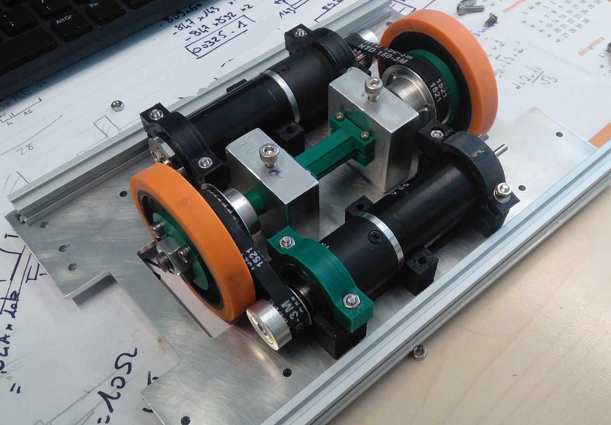

[Sommaire](../README.md)
# Matériel nécessaire pour l'asservissement
Bien, je vois que vous êtes intéressé par le sujet. Alors commençons.  
La manière la plus simple pour avoir un robot avec un déplacement précis (au mm) est d'avoir 2 roues motrices alignées sur le même axe à la même distance du centre du robot, et de roulettes à bille au tour pour éviter que le robot ne bascule (les roues motrices sur un bord ou au milieu, mais le bord reste plus simple à réaliser, pour éviter par exemple que les roues motrices se retrouvent à peine en contact avec le sol et tournent dans le vide (oui oui c'est déjà arrivé)).  
Le robot peut donc bouger, mais nous n'avons pas encore de retour sur le déplacement effectué (aucune précision). Pour cela il faut placer 2 roues odométriques à côté des roues motrices, et non pas placer l'encodeur sur la roue motrice au cas ou celle-ci déraperais, ce qui entraînerais une erreur importante sur la position du robot.  
Tout ce matériel est idéalement fixé sur plaque en aluminium (3 mm d'épaisseur) pour avoir une base solide qui ne se déforme pas.  
Il faut aussi important de considérer que l'aire de jeu n'est pas parfaitement plate, votre base ne doit donc pas être dérangée par un décrochement de quelques mm.

## Les roues motrices
### La manière simple
Elles sont au nombre de 2 et placée sur le même axe avec un pneu en gomme pleine. Si les moteurs ont un axe assez robuste et long pour pouvoir y accrocher un moteur il va falloir les aligner correctement pour que l'axe des 2 roues soient le même. Dans ce cas les moteurs sont idéalement fixés sur des équerre métalliques (en aluminium) aux dimensions du moteurs et fixées sur une plaque qui sert de base à l'ensemble du robot (l'aluminium d'une épaisseur de 3mm étant l'idéal). Il est souvent possible de récupérer la base de l'année précédente, mais il faut impérativement corriger les problèmes de celle-ci (jeu dans les roues motrices, dans la fixation des encodeurs).  
Si les roues ne peuvent pas être fixées directement au moteur il est possible de mettre les 2 roues sur le même axe fixe (en acier 8mm) montées sur des roulements et reliées aux moteurs par des courroies crantées (ou lisse). Mais un mélange des 2 méthodes est possible.
### Autres possibilités
Certaines équipes utilisent des roues holonomes (au nombre de 3, ce qui nécessite 3 moteurs). Cette méthode permet une grande manœuvrabilité du robot, mais dans ce cas les encodeurs sont situés sur les moteurs et il faut s'attendre à une grande dérive sur la position si le système n'est pas corrigé par une autre mesure.  
Un véhicule à 4 roues, plus compliqué à manœuvrer et à diriger.  
Des roues motrices orientables, peut s’avérer coûteux à réaliser.  
Toutes ces méthodes peuvent être plus compliqué à gérer au niveau du positionnement.  
Une méthode simple mais assez peu précise est d'utiliser des moteurs pas à pas (qui peuvent se piloter précisément dans retour (en boucle ouverte)) (2016-2017).

## Les encodeurs
### La manière la plus répandue
Pour pouvoir se repérer le robot doit connaître les déplacements réalisées. Pour cela sur le même axe que les roues motrice des encodeurs incrémentaux (dont il faut compter les changements pour connaître la position) sont placés. Ils doivent comporter leur propre roue (idéalement fixée sur l'axe de l'encodeur) en contact avec le sol. Cette roue doit être plaquée par un système qui translate verticalement et qui est plaqué au sol par des ressorts (il ne faut pas non plus que ça soulève le robot).  
Pour réaliser ce dispositif la structure peut être réalisée en impression 3D et les éléments de guidage avec 2 tiges rondes en acier (diamètre 8mm) et des douilles de guidage placées de part et d'autre de l'axe de l'encodeur.  
Les encodeurs doivent pouvoir supporter des déformations de l'aire de jeu (bosses de quelques mm) ainsi que les roues motrices, pour éviter toute surprise désagréable.
### Autres possibilités
Une variante du système décris ci-dessus et de plaquer l'encodeur avec un bras en rotation et d'un ressort. Mais ce système requiert une grande rigidité du mécanisme et une bonne qualité de réalisation (pas en impression 3D).  
Un capteur de souris peut aussi être utilisée pour connaître la position du robot (la légende raconte que ça marche).  
Tous les systèmes de balise permettent de recouper les informations de position. Mais mieux vaut avoir une odométrie fiable avant de passer du temps sur une autre tâche.

## Exemples de réalisation
La photo du [Sommaire](../README.md). 2 moteurs avec la roue montée directement sur l'axe de sortie. Un adaptateur a été imprimé pour tenir la roue et la bloquer sur le méplat du moteur (partie plate, si celle-ci manque il faut la créer à l'aide d'une lime ou d'un outil électrique en protégeant (avec du scotch) la partie moteur pour éviter de mettre de la limaille dans le moteur).  
Les fichiers de réalisation sont disponibles ici: https://github.com/robotronik/cdfr2018/tree/master/Mecanique  

La base de 3A+ en 2019.

2 roues motrices montées sur le même axe. Les 2 roues et les poulies sont visées ensemble et montées sur un roulement. Les roulements sont en butée sur les pièces imprimées en 3D positionnée sur l'axe. Et l'axe a été fileté pour maintenir les roulements sur l'axe. Les roues sont collées aux roulements. Les poulies des moteurs ont été percées le trou fileté (diamètre M3) pour les maintenir sur le méplat du moteur par une vis de pression.  
Si vous ne comprenez pas tous ces termes demander aux gens du club qui vous entourent ou directement en faisant vos recherches.  
Les fichiers de réalisation sont disponibles ici: <https://github.com/PhenixRobotik/theyseemerolling>
