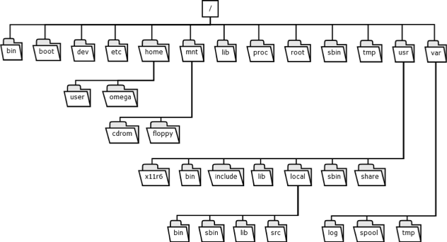

# L'arborescence

L'arborescence sous Linux correspond à la manière sont agencés les dossiers (directory en anglais) les uns par rapport aux autres.



Vous l'aurez peut être remarqué mais tous les dossiers mènent à /. Ce dossier a pour petit nom root. Il est ce que l'on appelle la racine du système. De ce dossier découle une floppé d'autre. Chacun à son utilité, nous allons voir quelques uns ensemble.

* home : ce dossier contient les fichiers des utilisateurs. C'est ici que se situe les données des utilisateurs.
* usr : ce dossier contient tous les binaires de l'utilisateur, leur documentation, des librairies, des header, etc …
* mnt : ce dossier est le dossier conventionnel pour monter des volumes (clé usb, lecteur cd, etc …). Il est possible de monter un volume où l'on veut dans son arborescence mais le système va monter par defaut les volume dans ce dossier.
* var : dans ce dossier se situe les applications/programmes installé par l'utilisateur.

## Chemin (PATH)

Dans un système UNIX, la notion de chemin est importante. Elle permet de se repérer dans une arborescence.

Il existe deux type de chemin :
* Les chemins **absolu**
* Les chemins **relatif**

### Chemin absolu

On appelle chemin absolu tout chemin exprimer en partant de la racine du système.

Par exemple le dossier ~ qui correspond au home (dossier de base pour un utilisateur) sont chemin absolu est :
```
/home/nom_de_l_utilisateur
```

### Chemin relatif

On appelle chemin relatif tout chemin dépendant du dossier courant où l'on se situe.

Par exemple si l'on affiche les fichiers cachés d'un dossiers il existe deux dossiers présents dans toutes l'arborescence :
* . : le dossier dans lequel on se situe
* .. : le dossier parent

Par exemple on se situe dans le dossier /home/nikola/Downloads. Si l'on veut aller dans le dossier ~ (/home/nikola) il est possible de le faire de deux manières :
* ``` $ cd /home/nikola``` si l'on utilise un chemin absolu
* ```$ cd ..``` si l'on utilise un chemin absolu

Comme .. est correspond au dossier parents du dossier dans lequel on se situe (dans notre exemple Downloads) ```cd ..``` permet de remonter au dossier parent (ici nikola).


[Sommaire](../README.md)
