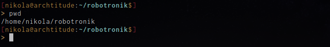
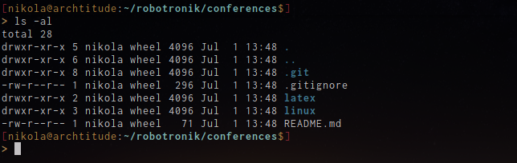
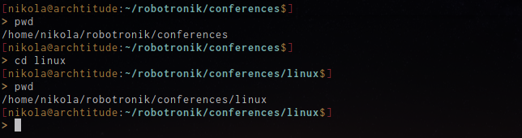
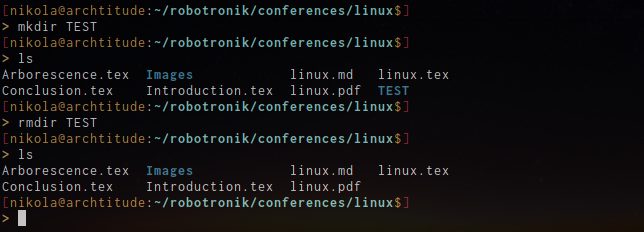

# Commandes de bases

Dans cette partie, nous allons voir les commandes de bases qui permettent de se débroullier dans un terminal.

À la différence de Windows, le terminal est un outils très utilisé sous linux. Il permet de :
* se déplacer dans l'arborescence des fichiers
* créer/supprimer des dossiers
*  créer/éditer/supprimer des fichiers

Évidemment il existe des outils graphiques pour effectuer ces différentes tâches mais parfois il peut être plus rapide de faire ces actions diretement dans le terminal.

## man (manual)
Si il y a une commande à connaître c'est bien celle là. man permet d'afficher le manuel associé à une commande.
Cette commande est très utile car elle permet d'obtenir des informations sur la commande voulue (son fonctionnement, les flags associé, …)

Utilisation :
```
$ man la_commande
```

## pwd (print working directory)
Cette commande permet de savoir où l'on se situe dans l'arborescence.

Utilisation :



## ls
Cette commande permet de lister les éléments présents dans un dossier.

Utilisation :


Il est possible d'ajouter des flags (drapeaux) à cette commande. Les flags sont des options que l'on peut affecter à une commande. La plupart du temps, la liste des flags affectable à une commande peuvent être trouver dans le manuel de cette commande.

Par exemple, si l'on ajoute le flag -a :


De nouveaux fichiers sont apparus. Le nom de ces fichiers est précédé d'un point. Cela signifie que ce sont des fichiers cachés. Si l'on demande pas de les afficher explicitement il ne seront pas visibles.

Plusieurs flags peuvent être utilisés en même temps. Par exemple, si l'on entre la commande :
```
$ ls -al
```

on obtient :



Ici, les fichiers cachés sont toujours affiché car nous avons mis le flag a mais l'affichage est changé. Cela est dû au flag -l qui permet d'obtenir plus d'inofrmation sur les fichiers commes leur taille, leurs autirisations, leur propriétaire et leur date de dernière modification.

## cd (change directory)

Cette commande permet - comme son nom l'indique - de changer de dossier.

Utilisation :



## mkdir (make directory) / rmdir (remove directory)
Ces deux commandes permettent de créer et supprimer des dossiers.

Utilisation :



Attention pour utiliser rmdir, il faut que le dossier que l'on veut supprimer soit vide. Sinon il faut utiliser la commande rm

## touch / rm (remove)
Ces deux commandes permettent de créer et supprimer des fichiers.

### touch
La commande touch ne permet de créer que des fichiers et non des dossiers. Pour créer un fichier il faut entrer cette commande :

```
$ touch nom_de_mon_fichier.extention_de_mon_fichier
```

Par exemple, disons que l'on veut créer un fichier pour ecrire un programme en C :


### rm
La commande rm permet de supprimer un élément. Elle pernet aussi de supprimer des dossiers non vide en lui affectant les bons flags.


## mv (move)
Nous avons vu comment créer et supprimer des fichiers dans le terminal mais il est aussi possible de les copier ou de les déplacer.

Si l'on veut copier un fichier dans un autre dossier il suffit d'entrer la commande suivante :

```
$ mv nom_du_fichier.extention_du_fichier chemin_du_novel_emplacement/nom_du_fichier.extention_du_fichier
```

## ping
Cette commande permet de connaître le temps que met un paquet entre une machine et un serveur. Elle peut être utiliser pour vérifier si sa connection internet est active.

Utilisation :


En plus de savoir si notre connection est active, la sortie de cette commande nous permet aussi d'avoir des informations sur la qualité de celle-ci.

[Sommaire](../README.md)
