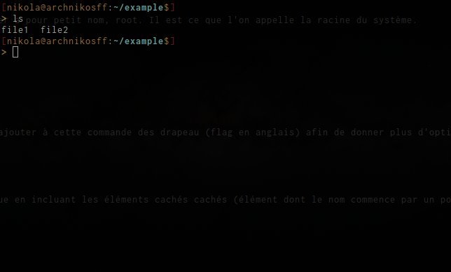
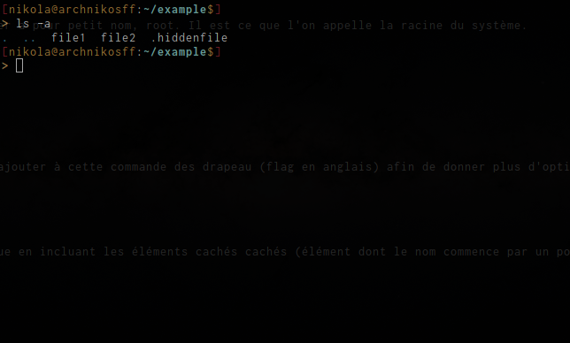
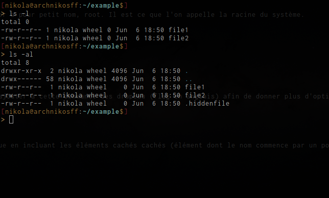

# Linux

Points abordés :
* Linux c'est quoi ?
* L'arborescence
* Commandes de bases
	* pwd
	* ls
	* cd 
	* mkdir/rmdir


## Linux c'est quoi ?

Linux ou plus précisément GNU/Linux est un système d'exploitation basé sur un noyau UNIX. À la différence de Windows, qui est basé sur un noyau DOS, Linux est open source, c'est à dire que tout le monde peut avoir accès aux code sources et les modifiés à sa guise. La seule règle étant de laisser son œuvre libre et disponible à tous.

## L'arborescence 
L'arborescence sous Linux correspond à la manière sont agencés les dossiers (directory en anglais) les uns par rapport aux autres. 

!!! Inclure image arborescence !!!

Vous l'aurez peut être remarqué mais tous les dossiers mènent à /. Ce dossier a pour petit nom, root. Il est ce que l'on appelle la racine du système. 

## Commandes de bases

### pwd

Cette commande permet de de savoir où l'on se situe dans l'arborescence. 

### ls

Cette commande permet de lister tous les éléments dans un dossier. Voici ce que l'on obtient :


On peut ajouter à cette commande des drapeau (flag en anglais) afin de donner plus d'option. Par exemple, si l'on entre dans le terminal la commande suivante :

```
$ ls -a
```


On va voir en sortie la liste des éléments du dossier dans lequel on se situe en incluant les éléments cachés cachés (élément dont le nom commence par un point).


```
$ ls -l
```


Ici, tous les éléments du dossiers sont listés mais il y a plus d'information sur ces éléments (les droits associés, le propriétaire sa date de modification).
De plus, il est possible d'associer plusieurs flags à une même commande. par exemple la seconde commande 
