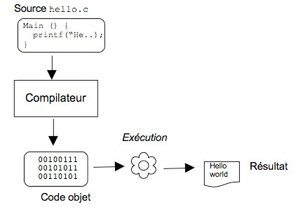

----

Comment qu'on exécute du code ?
===============================

Du code source au résultat :
----------------------------

L'étape de compilation :
------------------------

----

La compilation : Les détails
============================

Le Préprocesseur
----------------

Une étape de transformation *statique* du code source.

Le code source :

.. code-block:: c++

    #include <iostream>

    #ifndef MA_VALEUR
    #   define MA_VALEUR 4
    #endif

    #define HELLO_WORLD \
        std::cout << "hello world !" << std::endl;

    int main() {
        HELLO_WORLD
        std::cout << MA_VALEUR << std::endl;
    }

sera transformé avant compilation en :

.. code-block:: c++

    # 1 "content/preprocess_exemple.cpp"
    # 1 "<interne>"
    # 1 "<ligne-de-commande>"
    # 1 "/usr/include/stdc-predef.h" 1 3 4
    # 1 "<ligne-de-commande>" 2
    # 1 "content/preprocess_exemple.cpp"

    # 1 "/usr/include/c++/9.1.0/iostream" 1 3

    <contenu de iostream>

    # 9 "content/preprocess_exemple.cpp"
    int main() {
        std::cout << "hello world !" << std::endl;
        std::cout << 4 << std::endl;
    }

----

La compilation : Les détails
============================

Le Compilateur
--------------

* Invoquer le préprocesseur de façon transparente

    * Chercher les :code:`include`

* Optimiser le code

    * Boucles vides, regroupement ou réorganisation d'opérations,…

* Générer le code machine

* Optimiser le code machine en fonction du processeur cible

    * Unités spécifiques (vectorisation, calcul flottant,…)

* Ne génère *pas* un exécutable fonctionnel, seulement un fichier objet

    * ne contient pas les fonctions appelées (:code:`printf, std::*,`)

    * ne "sait" pas où sont les librairies (SDL, GTK,…)

    * ne contient pas le code d'initialisation

----

La compilation : Les détails
============================

Le linker
---------

* Regroupe les fichiers objet

* Cherche les librairies

* Résout les symboles (cherche les fonctions appelées d'un objet à l'autre)

    * La fonction existe-t-elle ?

    * Plusieurs définitions ?

    * etc

* Détermine les "sections" de l'exécutable

    * section d'instructions
    * sections de données (chaînes de caractère,…)

* Génère un exécutable fonctionnel

    * Code d'initialisation ":code:`_start`"

.. note::

    Analogie avec les Lego

----

La compilation : Il faut gérer tout ça
======================================

* Chaque outil a ses spécificités

* Chaque outil doit être exécuté avec les options (arguments) adaptées

Pour obtenir un exécutable facilement et de façon reproductible, il faut écrire un script qui :

* Liste les arguments de chaque outil

* Exécute les étapes dans le bon ordre

* Exécute uniquement les étapes nécessaires :

    * ne recompile que si c'est nécessaire

    * détermine automatiquement les fichiers à recompiler

* Parallélise les tâche sur le CPU
