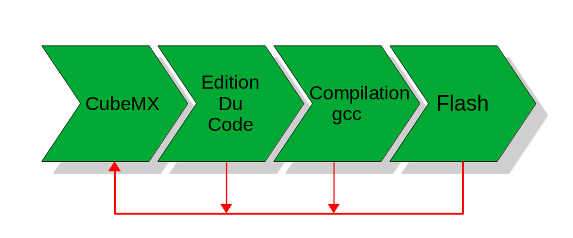
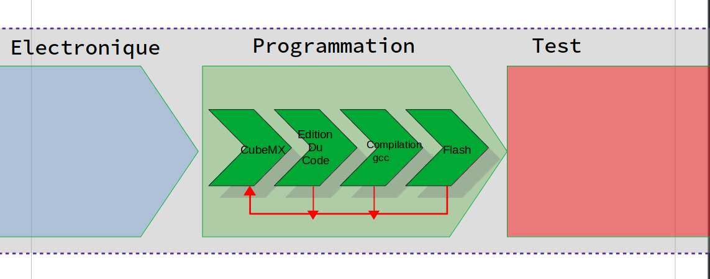
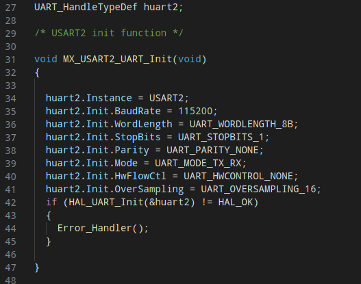
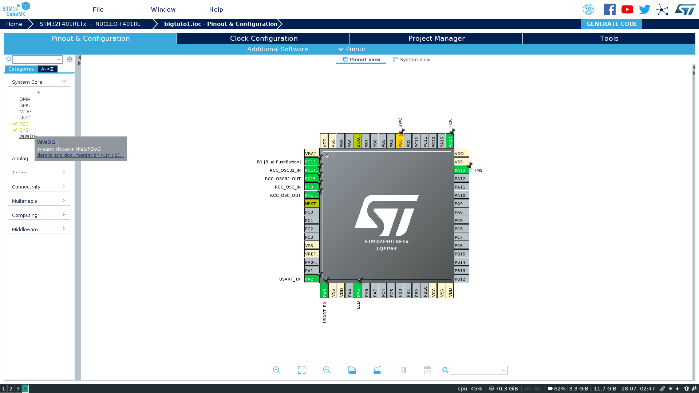
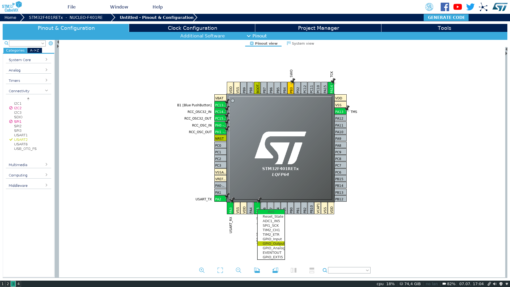
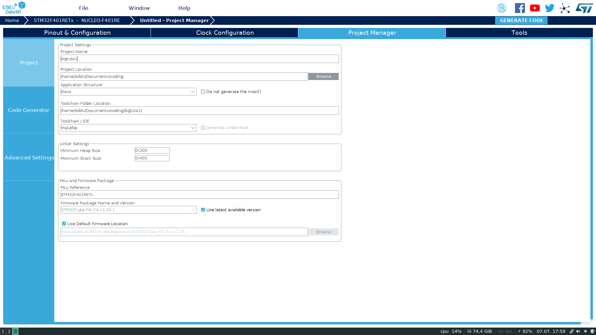
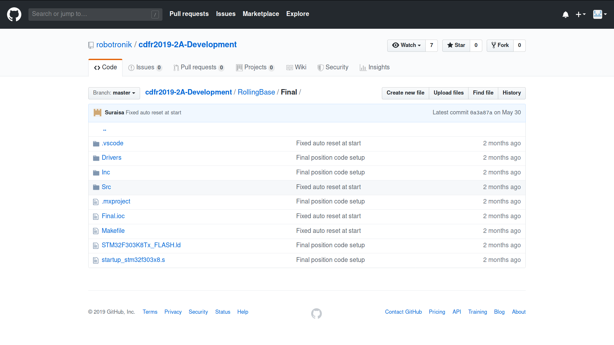
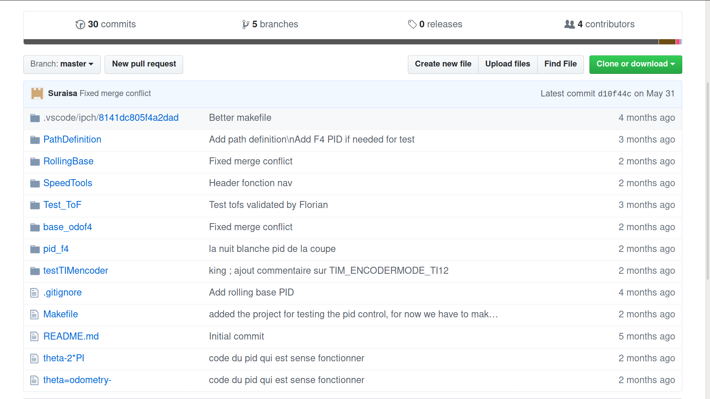

---
title: 'La Pipeline de développement Robotronik'
author: 
- Vincent Loibl -- loibl.vincent@gmail.com
description: | 
    avec révision de
date: 12.07.2019
...

***********************************************

# La Pipeline de développement Robotronik

## Introduction

> Pourquoi parler de *pipeline* de développement ?
Tout simplement parce que la pipeline explique toute les étapes de dévellopement pour un projet STM32. Connaître cette pipeline permet de comprendre les relations entre les différentes étapes de développement. C'est aussi un moyen d'avoir un environnement de développement commun, ainsi les tutoriels se baseront sur cette pipeline.
A l'association Robotronik, on choisit de laisser libre le choix des logiciels utilisé dans la pipeline. Ce document donne donc une liste non exhaustive des différents logiciels utilisables. Ainsi la pipeline est décomposé en 4 étapes :

* Configuration du MCU [^1]
* Edition du code de business
* Compilation & debogage 
* FLash du MCU



[^1]:MCU : MicroControler Unit

La pipeline Robotronik décris donc les étapes entre l'idée du projet et l'envoie du code compilé dans le MCU (MicroController Unit). La pipeline décrit quand même un environnement.
On utilise ici une ditribution Linux, dans mon cas je suis sous Manjaro 18.3 i3. Le code est majoritairement écris en language C. Le lecteur trouvera peut être interessant que en modifiant les flags de compilation, il est possible d'utiliser le language C++. Pour la compilation sous gcc on utilise généralement des scripts Makefile, et python pour automatiser certaines tâches.

**Vous savez pas ce que c'est ? lien de documentation :**

* wiki makefile

* le compilateur gcc

* python

* language cpp

* flags cpp 

On ne traitera ici que la pipeline *programmation*. Il faut garder en tête que cette pipeline s'inscrit dans un contexte plus grand de conception d'un robot complet.
*voir l'image ci dessous*



*************************************************

## Description de la pipeline

### Configuration du MCU

On peut distinguer deux type de code : le code de configuration et le code "actif" (de buisiness).
Le code de configuration c'est par exemple le code qui va initialiser les pins de votre MCU en entrée ou alors en sortie. Sur Arduino ce code ressemble à : 

```C
void setup() {
  pinMode(13, OUTPUT);    // sets the digital pin 13 as output
}
```

Le code "actif" est le code qui est généralement exécuté après le code de configuration. C'est par exemple une machine à états dans un robot ou ce que vous trouverez dans la fonction ``loop()`` avec la librairie arduino.
Traditionnellement la configuration des différents périfériques de la STM se fait par un code difficile à écrire et à lire car il faut avoir une compréhension poussée du microcontrôleur que l'on utilise. Contrairement à l'arduino, on a ici beaucoup plus de paramètres et d'options.



Néanmoins lorsque l'on utilise la librairie standard pour STM32, la HAL, on peut utiliser un outil qui peut nous faire gagner du temps. Cet outil est **CUBEMX**. C'est un logiciel développé par ST microélectronics qui par une interface GUI permet de configurer facilement tout les périfériques et de générer le code de configuration. Ce logiciel peut même recharger la configuration d'un projet et de regénérer un nouveau code de configuration sans supprimer le code de l'utilisateur (Vous).



Ici, sur la vue de CUBEMX on peut appercevoir une image du MCU à droite, et à gauche un onglet répertoriant tout les périfériques du MCU regrouppé par catégories comme *communication* ou encore *timer*. 

Le vrai avantage de ce logiciel, pour les débutants, est qu'il présente toute les fonctionnalitées du MCU. Ainsi, vous pouvez voir à gauche que votre MCU possède un **watchdog**, si vous ne savez pas ce que c'est, après une petite recherche internet, vous en apprennez plus sur le MCU. C'est un bon moyen de découvrir les différentes capacitées de votre MCU.

#### Exemple d'application simple avec cubemx
<br>

Un autre tutoriel approfondira l'utilisation du logiciel cubemx donc voici un court exemple d'utilisation du logiciel. 
Cet exemple a pour seul but de vous montrer le type de service que le logiciel propose. Pour plus d'information veuillez consulter le tuto "Hello Led" ou le tuto spécifique à cubemx.
Par exemple pour configurer un pin du MCU en entrée/sortie il suffit de cliquer sur le pin (ici PB3) et de sélectionner **GPIO_Output**.

Ensuite on peut paramètrer la génération du code en allant dans **Project Manager-> Project**.



Ici on peut spécifier que l'on veux utiliser gcc pour compiler notre projet et le répertoire du projet. Ensuite on clique sur le gros bouton **générer le code**. On peut ensuite regarder le répertoire du projet qui a été peuplé de beaucoup de fichiers et de dossiers.



Dans le répertoire du projet on retrouve :

* Drivers : Contient les diverses librairies nécessaires pour la compilation du code comme par exemple la HAL ou math.h ...

* Inc : Contient les .h du code C. 

* Src : Contient les .c du code C.

* Makefile : script de compilation du projet créé par cubemx. Il peut être utile de le modifier quand on crée ses propres fichiers .c, il faut alors ajouter le .c dans la variable **C_def**.

* nomDuProjet **.ioc** : Le fichier .ioc est le fichier qui enregistre la configuration actuelle du MCU. C'est le fichier que **cubemx** peut lire.

Si on regarde dans Src/gpio.c, on retrouve le code de configuration des pins de la STM. On trouve aussi des commentaires du type :
`*\ Begin ....\*`

`*\ END ... \*`

Ces commentaires deviennent utilent quand on veut changer le code de configuration en le regénérant avec CUBEMX. Ils délimitent la zone ou l'utilisateur peut écrire son code. Le code écrit entre les balises est garanti de ne pas être supprimé par la regénération de code.

*************************************************

### Edition du code

C'est ici que vous allez pouvoir écire le vrai code, le code qui est spécifique à votre projet. Vous devez écrire ce code entre les balises prévues à cet effet.

`*\ Begin ....\*`

`*\ END ... \*`

Vous pouvez même écrire vos propre .c et librairies et les ajouter dans le makefile de compilation. (voir tutoriel sur la programation).
Vous pouvez utiliser n'importe quel éditeur de texte pour cet étape, mais il est préférable d'utiliser un éditeur de code, c'est à dire un programme qui affiche les numéros des lignes, la coloration de la syntaxe etc... On peut donc choisir un logiciel comme notepad++, mousepad, vim, gedit. Il peut être préférable d'utiliser un éditeur de code plus poussé qui peut gérer plusieurs fichiers en même temps avec des raccouris claviers efficace. Dans ce cas vous pouvez utiliser un logiciel comme atom, visual code (code oss). Je laisse au lecteur la recherche de comment installer votre éditeur de code pour votre os et votre distribution personelle.

### Compilation

Une fois votre code écrit, il faut le compiler. Sauf que vous aller compiler sur votre machine (un intel Xeon par exemple) mais pour un processeur différent. Dans notre cas le processeur sera un 
ARM4. Il faut donc faire du cross-compiling. Pour cela vous allez devoir installer les packets suivants :
Pour ubuntu :

Pour manjaro:

*************

sudo pacman -S arm-none-eabi-gcc arm-none-eabi-newlib arm-none-eabi-gdb arm-none-eabi-binutils make openocd stlink

*************

Vous pourrez toujours utiliser notre script d'installation Robotronik, qui vous installera les packets nécessaires à la compilation ainsi que tout les autres packets nécessaires.
Ces logiciels sont des versions spéciales de gcc, le compilateur GNU, qui vont vous permettre de compiler pour des processeurs ARM ( donc les STM32 ) d'où **arm**-deabi-**gcc**.

***************

La compilation est effectué par des scripts makefile selon la structure suivante :

On remarque que tous les projets (PathDefinition ; RollingBase ; SpeedTools ...) sont cote à cote dans le repertoire projets. Ainsi il est très facile de changer les scripts de compilation pour compiler un autre projet.
En fait le **Makefile** sur l'image est un script de compilation (made in robotronix). Et en modifiant une variable dans ce script on peut changer de projet. Ce que ce script vraiment en réalité, c'est appeller un autre script de compilation qui se trouve dans le répertoire du projet et lui est spécifique.
Pour utiliser ce script, il suffit de l'appeler avec `make c` (c comme compilation).
L'avantage d'avoir le premier makefile et que l'on a tout les projets cote à cote, dans le même répertoire ce qui aide à organiser ses projets.

### Le flash

Vous avez compilé votre projet et debogué les différentes erreurs de compilation. 

Vous êtes prêt à flasher, c'est-à-dire téléverser le code compilé dans la mémoire intèrne du MCU. C'est l'avant dernière étape de la pipeline, juste avant le debogage. Pour cela vous devez brancher le st-link à votre ordinateur via un port USB. Le st-link est une carte électronique qui transforme le protocole USB vers le protocole Jtag, qui permet d'écrire dans la mémoire du MCU. Vous pouvez utiliser différents logiciels pour téléverser votre code. Traditionnellement l'association de robotique Robotronik utilise priotièrement des logiciels libre, c'est pourquoi nous avions utilisé openocd. Le repértoire openocd contient les fichiers de paramètrage pour les MCU STM32F4 par exemple. OpenOcd s'utilise avec la commande make f. Sinon vous pouvez utiliser stflash développé directement par st microélectronics. Il s'utilise par la commande make sf. Si vous avez des problème pour reconnaitre votre carte vous pouvez essayer d'utiliser les commande en mode super utilisateur (sudo ...) ou encore modifier les règles pour les ports USB.
En résumé tout ce que ces programmes font, c'est envoyer le code compilé se trouvant dans ./builds/... vers le MCU.

### Le debogage

Vous avez flashé votre MCU et rien ne se passe comme prévu. Pas de soucis, c'est une étape inévitable ; le débogage. 
Ce sujet dois prendre un tutoriel entier (cf le débogage sur stm32). Mais vous devez que vous avez 4 techniques principales de débogage :

* la led

* la transmission série

* gdb

* truestudio

# Conclusion

Cette "pipeline" a pour but non pas d'imposer des méthodes de manière autoritaire mais plutôt de poser des bases sur lequelles le club a déjà de l'expérience. Après comprenez que c'est plus simple d'écrire des tutoriels et fournir de l'aide pour un environnement unique. 
Finalement le plus important c'est de comprendre les outils que l'on utilise !